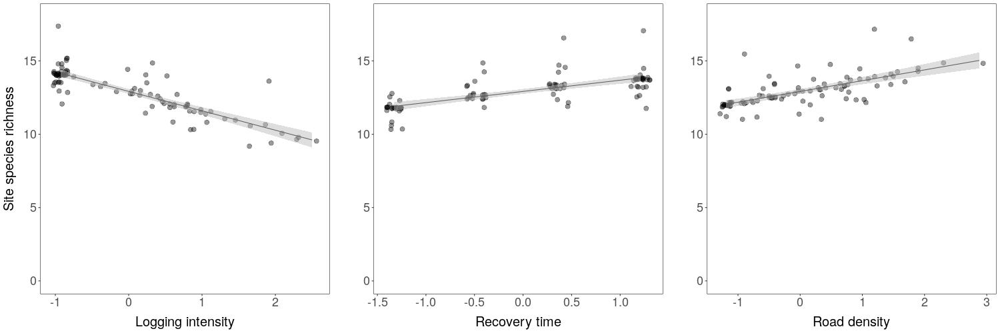

# Mammal-responses-logging-concessions
Mammal responses to reduced-impact logging in Amazonian forest concessions

Files for the paper "Mammal responses to reduced-impact logging in Amazonian forest concessions" by Carvalho Jr et al.

Contains the data and codes required to run the Bayesian multi-species occupancy model:

### Description

```data_jamari``` Data required for the analysis.

```analysis_code``` Code to run the Bayesian multi-species occupancy model. 




# Contact Us
If you have any questions please contact <elildojr@gmail.com>
